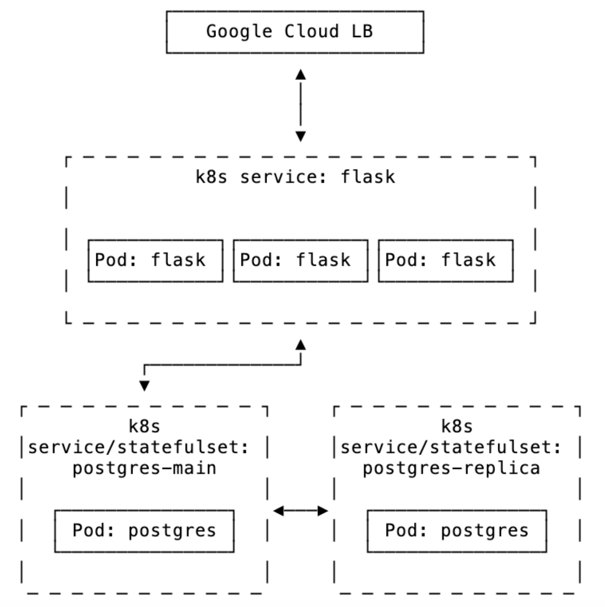

# Todo App

A simple todo list application fulfilling SRE Engineering Challenge under 20 hours. GCP-hosted app using Kubernetes with PostgreSQL replication.

## Architecture Overview

More on architecture, requirements, and implementaiton decisions see [Architecture & Implementation Decisions](docs/architecture.md)

## Features
- Todo list management with PostgreSQL backend
- Primary-replica database setup with streaming replication
- Kubernetes deployment on GKE
- Infrastructure as Code using Terraform and Helm
- Database schema management with Liquibase
- Automated CI pipeline via Github Actions
- Multi-environment setup staging/production

## Access
When it's up the application is publicly available at https://34.54.49.46.nip.io/

If it's down it's due to cost-savings, please request a demo and GCP viewer access if you'd like to see how it works.

## Prerequisites & Getting Started

This application requires several tools and cloud provider setup. Please refer to development and deployment guides:

- [Development Guide](docs/development.md) - For local development setup and testing
- [Deployment Guide](docs/deployment.md) - For GKE deployment instructions

## License
MIT License - See [LICENSE](LICENSE) for details
