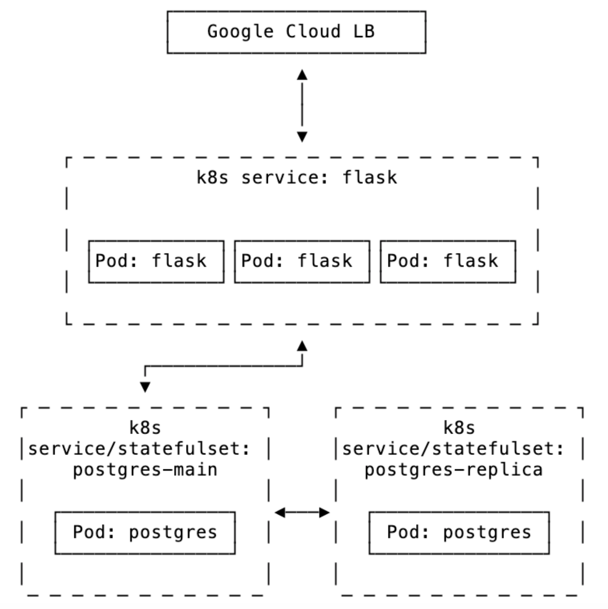

# Architecture & Implementation Decisions

This document outlines the required system architecture and explains the technical choices made for implementation.

## Requirements Overview

The application must implement:
- Flask-based web application with todo list functionality
- PostgreSQL database with primary-replica streaming replication
- GKE deployment with appropriate Kubernetes resources
- Self-managed database setup without using operators
- Access via Google Cloud Load Balancer

## Implementation Choices

### Naming

Service naming differs slightly from the diagram shown for clarity:
- `postgres-primary` (instead of `postgres-main`) for the database
- `todo-app` instead of (`flask`) for the application service

### Infrastructure Design

- **Environment Separation**
  - Separate staging/production VPC configurations with isolated subnet ranges
  - Enables independent testing and validation without production impact
  - Allows for different scaling and reliability requirements per environment

- **Node Pool Optimization**
  - Dedicated pools for database and application workloads
  - Database nodes use standard instances for reliability
  - Application workload uses spot instances for cost optimization
  - System workloads isolated to prevent resource contention

- **Terraform Structure**
  - Project-level setup separate from environment configurations
  - Enables consistent baseline across environments
  - State management in GCS for team collaboration
  - Workload identity federation for secure GitHub Actions integration

- **Access Configuration**
  - Kubernetes ingress resource to configure GCLB
  - Automatic certificate management via GKE managed certificates
  - Using nip.io for simple DNS resolution without domain management
  - Global static IP ensures stable endpoint across deployments

### Application Management

- **Multi-Chart Helm Design**
  - Separate charts for app, database, and migrations for independent lifecycle management
  - Allows focused updates and rollbacks without impacting other components
  - Simplified configuration management with environment-specific overrides
  - Reusable database chart for potential other applications

- **Liquibase Migration Strategy**
  - Version-controlled schema changes for audit and rollback capability
  - Environment-aware contexts prevent development-only changes in production
  - Kubernetes jobs ensure migrations complete before application deployment
  - Consistent schema management across all environments

### CI/CD Pipeline

- **GitHub Actions Workflow**
  - PR validation ensures code quality and test coverage
  - Semantic versioning for reliable release management
  - Container image management with vulnerability scanning
  - GCP authentication via workload identity for enhanced security

### Monitoring & Operations

- **Health Check Implementation**
  - Separate liveness and readiness probes
  - Database connectivity validation
  - Structured logging with GCP Cloud Logging integration
